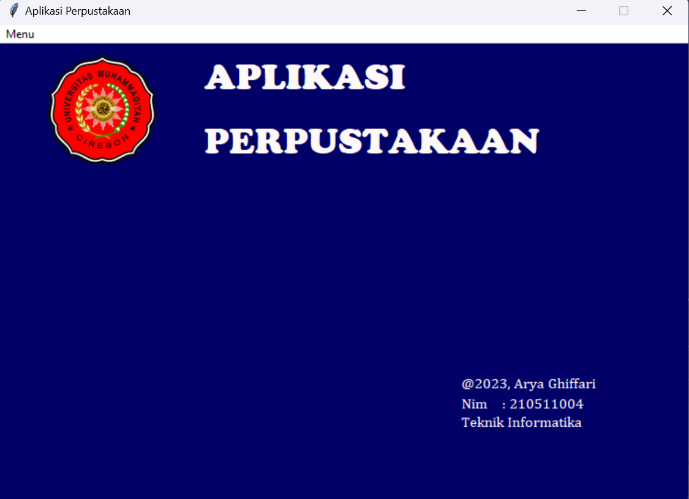
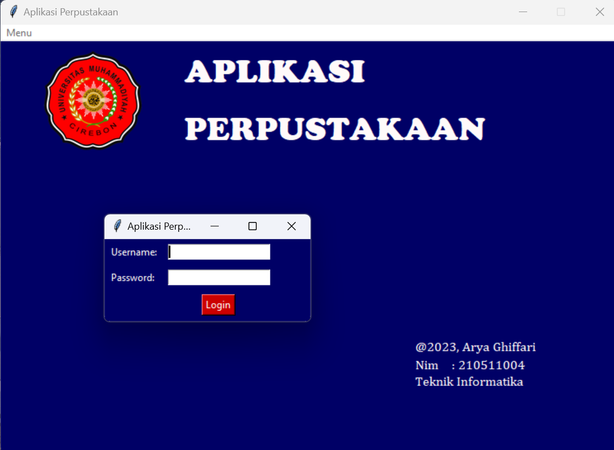
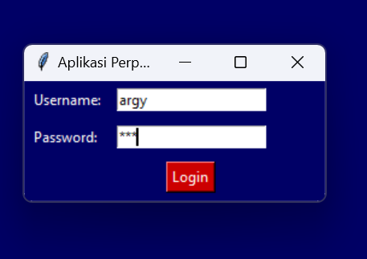
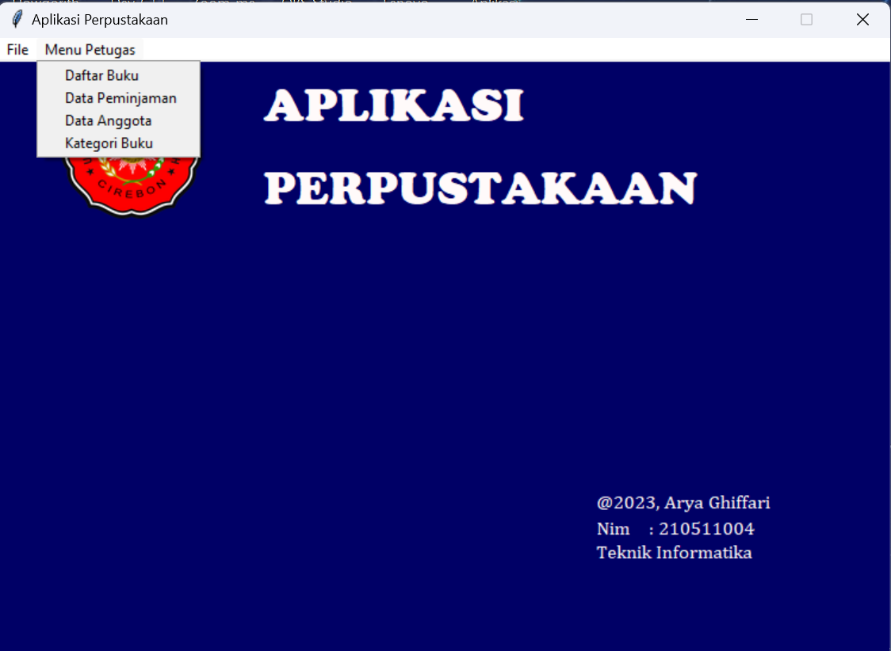
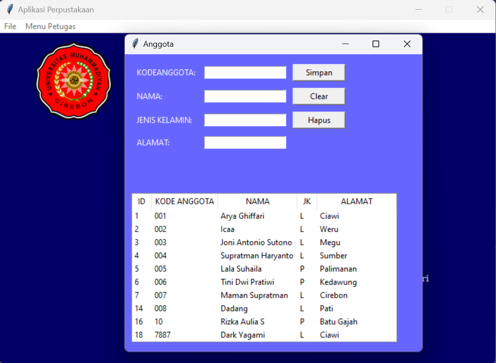
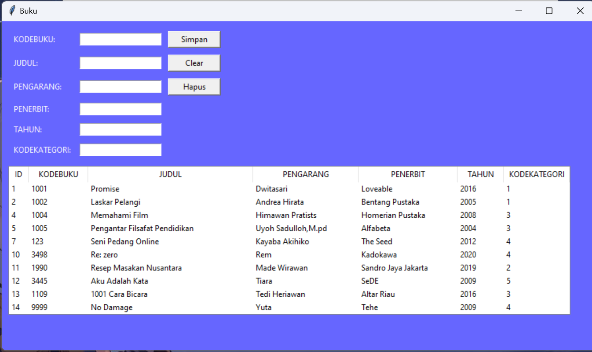
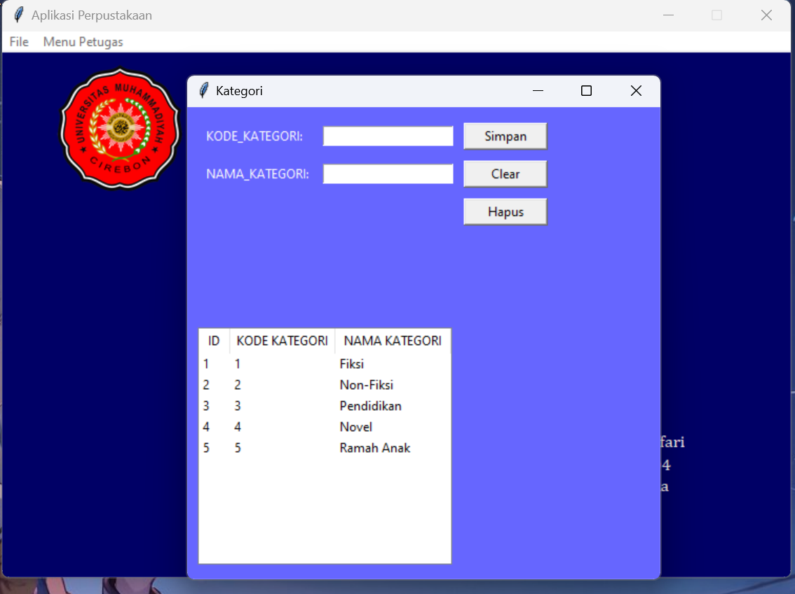
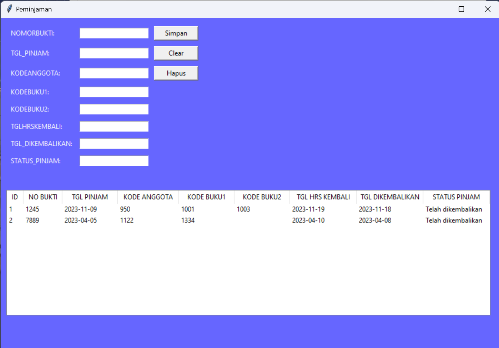

# Aplikasi Perpustakaan Sederhana

Sebuah Aplikasi Perpustakaan sederhana yang dibuat dengan bahasa Python, GUI TKINTER dan berbasis data pada localhost.

created by : Arya Ghiffari
Mahasiswa Teknik Informatika, Universitas Muhammadiyah Cirebon.

## Tampilan Dashboard

## Tampilan Menu Login

## Input Petugas Perpustkaan

## Menu Petugas Perpustakaan

## Daftar Anggota

## Koleksi Buku

## Kategori Buku

## Peminjaman Buku

